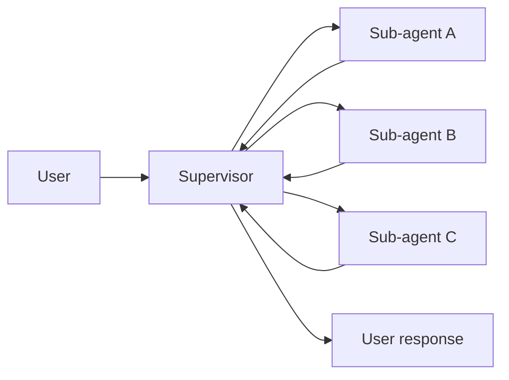
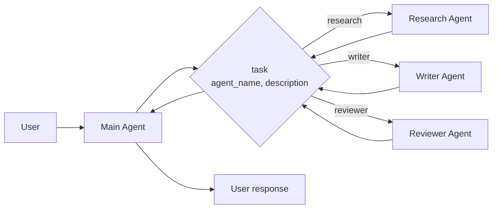
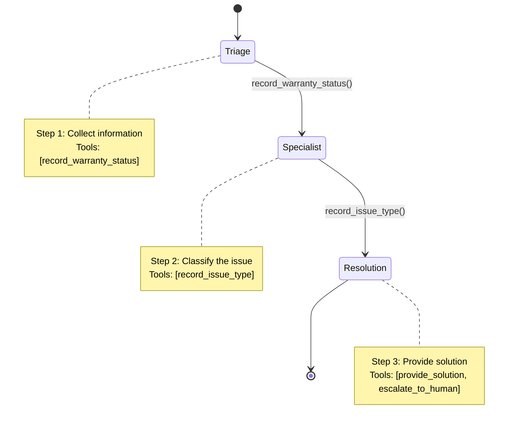
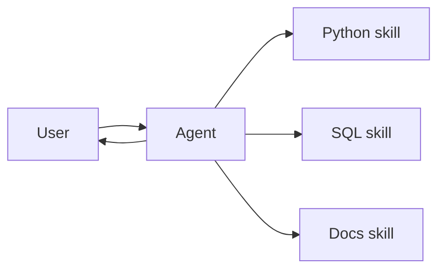
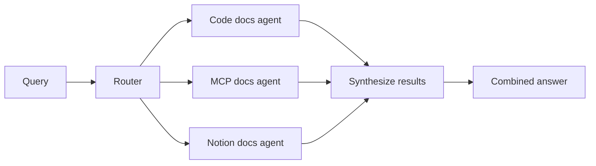

Multi-agent systems break complex applications into coordinated components. **Importantly, "multi-agent" doesn't necessarily mean multiple distinct agents** — a single agent with dynamic behavior can achieve similar capabilities.

## Why multi-agent?

When developers say they need "multi-agent," they're usually looking for one or more of these capabilities:

* **Context management**: Provide specialized knowledge without overwhelming the model's context window. If context were infinite and latency zero, you could dump all knowledge into a single prompt — but since it's not, you need patterns to selectively surface relevant information.
* **Distributed development**: Allow different teams to develop and maintain capabilities independently, composing them into a larger system with clear boundaries and independent testing.
* **Parallelization**: Spawn specialized workers for subtasks and execute them concurrently.

Multi-agent patterns are particularly valuable when a single agent has too many [tools](/oss/python/langchain/tools) and makes poor decisions about which to use, when tasks require specialized knowledge with extensive context (long prompts and domain-specific tools), or when you need to enforce sequential constraints that unlock capabilities only after certain conditions are met.

## Context engineering

At the center of multi-agent design is **[context engineering](/oss/python/langchain/context-engineering)** — deciding what information each agent sees. LangChain gives you fine-grained control over which parts of the conversation or state are passed to each agent, specialized prompts tailored to sub-agents, inclusion or exclusion of intermediate reasoning, and customizing input/output formats per agent.

The quality of your system depends on context engineering. The goal is to ensure that each agent has access to the correct data it needs to perform its task, whether it's acting as a tool or as an active agent.

## Patterns

Here are the main patterns for building multi-agent systems, each suited to different use cases:

| Pattern | How it works |
|--------------|--------------|
| [**Supervisor**](#supervisor) | A supervisor agent calls other agents as tools. Centralized control — all routing passes through the supervisor. |
| [**Spawning subagents**](#spawning-subagents) | A single parameterized tool spawns different sub-agents using a convention-based approach. Simplifies adding new agents across teams — trades customization for scalability. |
| [**State machine**](#state-machine) | Single agent whose configuration (prompt, tools, capabilities) changes as it moves through different states. Efficient for sequential workflows — one tool call both performs the action and transitions to the next state. |
| [**Skills**](#skills) | Specialized prompts loaded on-demand. The main agent stays in control and gains additional context as needed. |
| [**Router**](#router) | A routing step classifies input and directs it to one or more specialized agents. Results are collected and returned to the user. |
| [**Custom workflow**](#custom-workflow) | Build bespoke logic with LangGraph, mixing deterministic and agentic steps. Reuse or customize agents as needed. |

<Tip>
    You can mix patterns! For example, a **supervisor** can manage **workflow** sub-graphs or use the **router** pattern as a tool (querying multiple knowledge bases in parallel, then synthesizing results). A **state machine** can invoke **skills** at specific stages (loading specialized context only when reaching certain steps). **Spawning subagents** can work within a **custom workflow** to parallelize independent tasks while maintaining deterministic overall structure.
</Tip>

**Common mechanisms:** These patterns share common mechanisms for coordinating multi-agent behavior. Most rely on **tool calling** as the primary coordination mechanism—tools can invoke sub-agents ([supervisor](#supervisor), [spawning subagents](#spawning-subagents)), update state to trigger routing or behavior changes ([state machine](#state-machine)), load context on-demand ([skills](#skills)), or even invoke entire multi-agent systems (like wrapping a [router](#router) as a tool).

Tools drive dynamic behavior: updating state to route between agents, loading context, changing configuration, or spawning sub-agents. Patterns can also use middleware to modify system prompts or implement deterministic routing ([custom workflows](#custom-workflow)).

**[Progressive disclosure](/oss/python/langchain/progressive-disclosure-skills)** loads information on-demand, valuable for managing large amounts of context. It combines retrieval with dynamic state updates (registering tools, discovering sub-agents). However, it adds latency through extra tool calls—simpler patterns like [state machine](#state-machine) often suffice when context is manageable or sequential constraints are needed.

## Supervisor

In the **supervisor** architecture, a central supervisor agent coordinates sub-agents by calling them as tools. The supervisor decides which sub-agent to invoke, what input to provide, and how to combine results.



**Key characteristics:**

* Centralized control: All routing passes through the supervisor
* Sub-agents as tools: Each sub-agent is wrapped as a callable tool
* No direct user interaction: Sub-agents return results to the supervisor, not the user
* Parallel execution: The supervisor can invoke multiple sub-agents in a single turn

Use the supervisor pattern when you have multiple distinct domains (e.g., calendar, email, CRM, database), sub-agents don't need to converse directly with users, or you want centralized workflow control. For simpler cases with just a few tools, use a single agent.

<Card
    title="Tutorial: Build a supervisor agent"
    icon="sitemap"
    href="/oss/python/langchain/supervisor"
    arrow cta="Learn more"
>
    Learn how to build a personal assistant using the supervisor pattern, where a central supervisor agent coordinates specialized worker agents.
</Card>

The key idea is wrapping sub-agents as tools that the supervisor can call:

```python
from langchain.tools import tool
from langchain.agents import create_agent

# Create a sub-agent
subagent = create_agent(model="...", tools=[...])  # [!code highlight]

# Wrap it as a tool  # [!code highlight]
@tool("subagent_name", description="subagent_description")  # [!code highlight]
def call_subagent(query: str):  # [!code highlight]
    result = subagent.invoke({"messages": [{"role": "user", "content": query}]})
    return result["messages"][-1].content

# Supervisor agent with sub-agent as a tool  # [!code highlight]
supervisor = create_agent(model="...", tools=[call_subagent])  # [!code highlight]
```


The supervisor invokes the sub-agent tool when it decides the task matches the sub-agent's description, receives the result, and continues orchestration.

There are several points where you can control how context is passed between the main agent and its subagents:

1. **Sub-agent name** (`"subagent_name"`): This is how the main agent refers to the sub-agent. Since it influences prompting, choose it carefully.
2. **Sub-agent description** (`"subagent_description"`): This is what the main agent knows about the sub-agent. It directly shapes how the main agent decides when to call it.
3. **Input to the sub-agent**: You can customize this input to better shape how the sub-agent interprets tasks. In the example above, we pass the agent-generated `query` directly.
4. **Output from the sub-agent**: This is the response passed back to the main agent. You can adjust what is returned to control how the main agent interprets results. In the example above, we return the final message text, but you could return additional state or metadata.

<Accordion title="Customizing sub-agent input">

There are two main levers to control the input that the main agent passes to a sub-agent: modifying the prompt (adjust the main agent's prompt or tool metadata to better guide when and how it calls the sub-agent) or context injection (add input that isn't practical to capture in a static prompt, like full message history, prior results, or task metadata, by adjusting the tool call to pull from the agent's state).

```python
from langchain.agents import AgentState
from langchain.tools import tool, ToolRuntime

class CustomState(AgentState):
    example_state_key: str

@tool(
    "subagent1_name",
    description="subagent1_description"
)
def call_subagent1(query: str, runtime: ToolRuntime[None, CustomState]):
    # Apply any logic needed to transform the messages into a suitable input
    subagent_input = some_logic(query, runtime.state["messages"])
    result = subagent1.invoke({
        "messages": subagent_input,
        # You could also pass other state keys here as needed.
        # Make sure to define these in both the main and subagent's
        # state schemas.
        "example_state_key": runtime.state["example_state_key"]
    })
    return result["messages"][-1].content
```


</Accordion>

<Accordion title="Customizing sub-agent output">

Two common strategies for shaping what the main agent receives back from a sub-agent: First, modify the sub-agent's prompt to specify exactly what should be returned—this is useful when outputs are incomplete, too verbose, or missing key details. A common failure mode is that the sub-agent performs tool calls or reasoning but doesn't include the results in its final message; remind it that the controller and user only see the final output, so all relevant info must be included there. Second, adjust or enrich the sub-agent's response in code before handing it back to the main agent—for example, pass specific state keys back in addition to the final text. This requires wrapping the result in a [`Command`](https://reference.langchain.com/python/langgraph/types/#langgraph.types.Command) (or equivalent structure) so you can merge custom state with the sub-agent's response.

```python
from typing import Annotated
from langchain.agents import AgentState
from langchain.tools import InjectedToolCallId
from langgraph.types import Command


@tool(
    "subagent1_name",
    description="subagent1_description"
)
# We need to pass the `tool_call_id` to the sub agent so it can use it to respond with the tool call result
def call_subagent1(
    query: str,
    tool_call_id: Annotated[str, InjectedToolCallId],
# You need to return a `Command` object to include more than just a final tool call
) -> Command:
    result = subagent1.invoke({
        "messages": [{"role": "user", "content": query}]
    })
    return Command(update={
        # This is the example state key we are passing back
        "example_state_key": result["example_state_key"],
        "messages": [
            ToolMessage(
                content=result["messages"][-1].content,
                # We need to include the tool call id so it matches up with the right tool call
                tool_call_id=tool_call_id
            )
        ]
    })
```


</Accordion>


## Spawning subagents

In the **spawning subagents** architecture, a central agent uses a single parameterized tool to spawn ephemeral sub-agents for independent tasks. Unlike the [supervisor pattern](#supervisor) where each sub-agent is wrapped as a separate tool, this pattern uses a convention-based approach with a single `task` tool: the task description is passed as a human message to the sub-agent, and the sub-agent's final message is returned as the tool result.



**Key characteristics:**

* Single task tool: One parameterized tool that can invoke any registered sub-agent by name
* Convention-based context: Task description passes as human message, output is the final message content
* Ephemeral execution: Each sub-agent invocation is stateless and returns a single result
* Context isolation: Helps manage context by offloading complex tasks to isolated threads
* Team distribution: Different teams can develop and deploy agents independently
* Agent discovery: Sub-agents can be discovered via system prompt (listing available agents) or through [progressive disclosure](/oss/python/langchain/progressive-disclosure-skills) (loading agent information on-demand via tools)

**When context isolation matters most:**

An interesting aspect of this pattern is that sub-agents may have the exact same capabilities as the main agent. In such cases, spawning a sub-agent is **really about context isolation** as the primary reason—allowing complex, multi-step tasks to run in isolated context windows without bloating the main agent's conversation history. The sub-agent completes its work autonomously and returns only a concise summary, keeping the main thread focused and efficient.

Use the spawning subagents pattern when you want to distribute agent development across multiple teams, need to isolate complex tasks into separate context windows, need a scalable way to add new agents without modifying the coordinator, or prefer convention over customization. This pattern trades flexibility in context engineering for simplicity in agent composition and strong context isolation.

```python
from langchain.tools import tool
from langchain.agents import create_agent

# Sub-agents developed by different teams
research_agent = create_agent(
    model="gpt-4o",
    prompt="You are a research specialist..."
)

writer_agent = create_agent(
    model="gpt-4o",
    prompt="You are a writing specialist..."
)

# Registry of available sub-agents
SUBAGENTS = {
    "research": research_agent,
    "writer": writer_agent,
}

@tool
def task(
    agent_name: str,
    description: str
) -> str:
    """Launch an ephemeral subagent for a task.

    Available agents:
    - research: Research and fact-finding
    - writer: Content creation and editing
    """
    agent = SUBAGENTS[agent_name]
    result = agent.invoke({
        "messages": [
            {"role": "user", "content": description}
        ]
    })
    return result["messages"][-1].content

# Main coordinator agent
main_agent = create_agent(
    model="gpt-4o",
    tools=[task],
    system_prompt=(
        "You coordinate specialized sub-agents. "
        "Available: research (fact-finding), "
        "writer (content creation). "
        "Use the task tool to delegate work."
    ),
)
```


<Tip>
**Spawning subagents vs Supervisor**: The [supervisor pattern](#supervisor) wraps each sub-agent as a separate tool with custom input/output handling, giving fine-grained control over context engineering. The spawning subagents pattern uses a single tool with a consistent convention, making it easier to add new agents but harder to customize how each agent receives context.
</Tip>


## State machine

In the **state machine** architecture, you have a single agent whose behavior (prompt, tools, and capabilities) changes dynamically based on state. The state machine is implemented via [middleware](/oss/python/langchain/middleware/overview) that performs transitions through tool calls.



**Key characteristics:**

* State-driven configuration: A single agent whose prompts and tools change dynamically based on a state variable (e.g., `current_step`)
* Direct user interaction: Each step's configuration handles user messages directly
* Persistent state: State survives across conversation turns

<Tip>
**Alternative to handoffs**: This pattern can be more efficient than handoff-based approaches like [OpenAI's agent handoffs](https://openai.github.io/openai-agents-python/handoffs/) or [LangGraph swarm](https://github.com/langchain-ai/langgraph-swarm-py). Depending on implementation, handoffs may require two tool calls (transfer control, then act) while state machines can combine both. Because it's a single agent switching behaviors rather than distinct agents, it's simpler to streamline the tool calls and manage the conversation context correctly.
</Tip>

Use the state machine pattern when you need to enforce sequential constraints (unlock capabilities only after preconditions are met), the agent needs to converse directly with the user across different states, or you're building multi-stage conversational flows. This pattern is particularly valuable for customer support scenarios where you need to collect information in a specific sequence — for example, collecting a warranty ID before processing a refund.

<Card
    title="Tutorial: Build a customer support agent using a state machine"
    icon="people-arrows"
    href="/oss/python/langchain/customer-support-state-machine"
    arrow cta="Learn more"
>
    Learn how to build a customer support agent using the state machine pattern, where a single agent transitions between different configurations.
</Card>

At the core, the state machine pattern relies on [persistent state](/oss/python/langchain/short-term-memory) that survives across conversation turns:

1. **State variable**: A field in your state schema (e.g., `current_step: str`) tracks which step is currently active.
2. **State update tool**: The agent uses a tool to change the value of `current_step` when transitioning to the next step.
3. **Dynamic configuration**: On each turn, middleware reads `current_step` from the persisted state and dynamically configures the appropriate system prompt, tools, and behavior.

This pattern creates a state machine where each step represents a distinct state with its own configuration and capabilities.

<Accordion title="View complete example">

```python
from langchain.agents import AgentState, create_agent
from langchain.agents.middleware import wrap_model_call, ModelRequest, ModelResponse
from langchain.tools import tool, ToolRuntime
from langchain.messages import ToolMessage
from langgraph.types import Command
from typing import Callable

# 1. Define state with current_step tracker
class SupportState(AgentState):  # [!code highlight]
    """Track which step is currently active."""
    current_step: str = "triage"  # [!code highlight]
    warranty_status: str | None = None

# 2. Tools update current_step via Command
@tool
def record_warranty_status(
    status: str,
    runtime: ToolRuntime[None, SupportState]
) -> Command:  # [!code highlight]
    """Record warranty status and transition to next step."""
    return Command(update={  # [!code highlight]
        "messages": [  # [!code highlight]
            ToolMessage(
                content=f"Warranty status recorded: {status}",
                tool_call_id=runtime.tool_call_id
            )
        ],
        "warranty_status": status,
        "current_step": "specialist"  # Transition to next step  # [!code highlight]
    })

# 3. Middleware applies dynamic configuration based on current_step
@wrap_model_call  # [!code highlight]
def apply_step_config(
    request: ModelRequest,
    handler: Callable[[ModelRequest], ModelResponse]
) -> ModelResponse:
    """Configure agent behavior based on current_step."""
    step = request.state.get("current_step", "triage")  # [!code highlight]

    # Map steps to their configurations
    configs = {
        "triage": {
            "prompt": "Collect warranty information...",
            "tools": [record_warranty_status]
        },
        "specialist": {
            "prompt": "Provide solutions based on warranty: {warranty_status}",
            "tools": [provide_solution, escalate]
        }
    }

    config = configs[step]
    request = request.override(  # [!code highlight]
        system_prompt=config["prompt"].format(**request.state),  # [!code highlight]
        tools=config["tools"]  # [!code highlight]
    )
    return handler(request)

# 4. Create agent with middleware
agent = create_agent(
    model,
    tools=[record_warranty_status, provide_solution, escalate],
    state_schema=SupportState,
    middleware=[apply_step_config],  # [!code highlight]
    checkpointer=InMemorySaver()  # Persist state across turns  # [!code highlight]
)
```


</Accordion>

The key mechanism: tools use [`Command`](https://reference.langchain.com/python/langgraph/types/#langgraph.types.Command) to update `current_step`, then middleware reads this state and dynamically configures the agent's system prompt and available tools on each turn.


## Skills

In the **skills** architecture, specialized capabilities are packaged as invokable "skills" that augment an agent's behavior. Skills are primarily prompt-driven specializations that an agent can invoke on-demand.



**Key characteristics:**

* Prompt-driven specialization: Skills are primarily defined by specialized prompts
* Progressive disclosure: Skills become available based on context or user needs
* Team distribution: Different teams can develop and maintain skills independently
* Lightweight composition: Skills are simpler than full sub-agents

Use the skills pattern when you want a single agent with many possible specializations, you don't need to enforce specific constraints between skills, or different teams need to develop capabilities independently. Common examples include coding assistants (skills for different languages or tasks), knowledge bases (skills for different domains), and creative assistants (skills for different formats).

```python
from langchain.tools import tool
from langchain.agents import create_agent

@tool
def load_skill(skill_name: str) -> str:
    """Load a specialized skill prompt.

    Available skills:
    - write_sql: SQL query writing expert
    - review_legal_doc: Legal document reviewer

    Returns the skill's prompt and context.
    """
    # Load skill content from file/database
    ...

agent = create_agent(
    model="gpt-4o",
    tools=[load_skill],
    system_prompt=(
        "You are a helpful assistant. "
        "You have access to two skills: "
        "write_sql and review_legal_doc. "
        "Use load_skill to access them."
    ),
)
```


<Tip>
**Dynamic tool registration**: When writing custom implementations, you can combine progressive disclosure with state management to register new tools as skills load. For example, loading a "database_admin" skill could both add specialized context and register database-specific tools (backup, restore, migrate). This uses the same tool-and-state mechanisms described in [Common mechanisms across patterns](#common-mechanisms-across-patterns)—tools updating state to dynamically change agent capabilities.
</Tip>

<Card
    title="Tutorial: Build an agent with on-demand skill loading"
    icon="wand-magic-sparkles"
    href="/oss/python/langchain/progressive-disclosure-skills"
    arrow cta="Learn more"
>
    Learn how to implement skills with progressive disclosure, where the agent loads specialized prompts and schemas on-demand rather than upfront.
</Card>


## Router

In the **router** architecture, a routing step decomposes the input and directs it to one or more specialized agents. The router can use query decomposition to determine which domain experts to consult, then runs them in parallel. Results from all agents are collected, synthesized, and returned.



**Key characteristics:**

* Query decomposition: Router breaks down questions and determines which experts to consult
* Domain experts: Each agent specializes in a specific knowledge base or domain
* Parallel execution: Multiple agents process the request concurrently
* Result synthesis: Outputs from specialized agents are combined into a coherent response
* Stateless design: Best suited for single-turn requests rather than multi-turn conversations

This pattern excels at combining expertise from multiple domains. It's best thought of as a stateless API — a tool that takes a query and returns synthesized results. While it could be adapted for conversations (by including past interactions in prompts), a simpler approach is to expose the entire router as a tool that another conversational agent can call.

<Tip>
**Router vs Supervisor**: The [supervisor pattern](#supervisor) can also route to multiple agents. Use the router pattern when you need specialized preprocessing or custom routing logic. Use the supervisor pattern when you want the LLM to decide which agents to call dynamically.
</Tip>

Use the router pattern when you have distinct knowledge domains that need to be queried, questions that benefit from consulting multiple experts, or you want to parallelize search across multiple data sources. Common examples include documentation search across multiple repositories, research assistants querying different knowledge bases, and content retrieval from diverse sources.

<Accordion title="Example: Documentation search router">

Your organization's documentation lives in multiple places: code repositories, MCP protocol specifications, and internal Notion pages. When users ask questions like "How do I authenticate API requests?", the answer often requires information from all three sources. This example builds a router that decomposes queries, identifies which knowledge bases to consult, queries them in parallel using specialized agents, and synthesizes the results into a comprehensive answer.

```python
from typing import TypedDict
from langgraph.graph import StateGraph, START, END, Send
from langchain.agents import create_agent
from langchain_openai import ChatOpenAI

class DocsState(TypedDict):
    query: str
    routes: list[str]  # Which knowledge bases to query
    code_docs_result: str | None
    mcp_docs_result: str | None
    notion_docs_result: str | None
    final_answer: str

# Domain expert agents with specialized knowledge
code_docs_agent = create_agent(
    model="openai:gpt-4o",
    prompt="You are a code documentation expert. Answer questions about API references, code examples, and implementation details.",
    name="code_docs"
)

mcp_docs_agent = create_agent(
    model="openai:gpt-4o",
    prompt="You are an MCP (Model Context Protocol) expert. Answer questions about MCP servers, tools, and integrations.",
    name="mcp_docs"
)

notion_docs_agent = create_agent(
    model="openai:gpt-4o",
    prompt="You are a company knowledge expert. Answer questions about internal processes, policies, and team documentation.",
    name="notion_docs"
)

router_llm = ChatOpenAI(model="gpt-4o-mini")

def decompose_query(state: DocsState) -> dict:  # [!code highlight]
    """Decompose query and determine which knowledge bases to consult."""  # [!code highlight]
    response = router_llm.invoke([
        {
            "role": "system",
            "content": "Analyze this query and determine which knowledge bases to consult. Return a JSON list with one or more of: 'code_docs', 'mcp_docs', 'notion_docs'."
        },
        {"role": "user", "content": state["query"]}
    ])
    # Parse LLM response to get routes (simplified for example)
    routes = ["code_docs", "mcp_docs"]  # In practice, parse from LLM response
    return {"routes": routes}

# Route to multiple agents in parallel  # [!code highlight]
def route_to_agents(state: DocsState) -> list[Send]:  # [!code highlight]
    """Fan out to multiple agents in parallel."""  # [!code highlight]
    return [Send(route, state) for route in state["routes"]]  # [!code highlight]

def query_code_docs(state: DocsState) -> dict:
    result = code_docs_agent.invoke({
        "messages": [{"role": "user", "content": state["query"]}]
    })
    return {"code_docs_result": result["messages"][-1].content}

def query_mcp_docs(state: DocsState) -> dict:
    result = mcp_docs_agent.invoke({
        "messages": [{"role": "user", "content": state["query"]}]
    })
    return {"mcp_docs_result": result["messages"][-1].content}

def query_notion_docs(state: DocsState) -> dict:
    result = notion_docs_agent.invoke({
        "messages": [{"role": "user", "content": state["query"]}]
    })
    return {"notion_docs_result": result["messages"][-1].content}

def synthesize_results(state: DocsState) -> dict:  # [!code highlight]
    """Combine results from multiple agents into a coherent answer."""  # [!code highlight]
    results = []
    if state.get("code_docs_result"):
        results.append(f"Code Docs: {state['code_docs_result']}")
    if state.get("mcp_docs_result"):
        results.append(f"MCP Docs: {state['mcp_docs_result']}")
    if state.get("notion_docs_result"):
        results.append(f"Notion: {state['notion_docs_result']}")

    # Use LLM to synthesize
    synthesis_response = router_llm.invoke([
        {"role": "system", "content": "Synthesize these search results into a coherent answer."},
        {"role": "user", "content": "\n\n".join(results)}
    ])
    return {"final_answer": synthesis_response.content}

# Build workflow with parallel execution
workflow = (
    StateGraph(DocsState)
    .add_node("decompose", decompose_query)
    .add_node("code_docs", query_code_docs)
    .add_node("mcp_docs", query_mcp_docs)
    .add_node("notion_docs", query_notion_docs)
    .add_node("synthesize", synthesize_results)
    .add_edge(START, "decompose")
    .add_conditional_edges("decompose", route_to_agents, ["code_docs", "mcp_docs", "notion_docs"])  # [!code highlight]
    .add_edge("code_docs", "synthesize")
    .add_edge("mcp_docs", "synthesize")
    .add_edge("notion_docs", "synthesize")
    .add_edge("synthesize", END)
    .compile()
)

result = workflow.invoke({"query": "How do I use MCP with FastAPI?"})
print(result["final_answer"])
```


</Accordion>

<Tip>
**Using routers as tools**: The entire router workflow can be exposed as a tool that another agent calls. This is simpler than trying to make the router itself conversational.

```python
@tool
def search_docs(query: str) -> str:
    """Search across multiple documentation sources."""
    result = workflow.invoke({"query": query})
    return result["final_answer"]

# Now any conversational agent can use this tool
conversational_agent = create_agent(
    model,
    tools=[search_docs],
    prompt="You are a helpful assistant. Use search_docs to answer questions."
)
```


</Tip>


## Custom workflow

In the **custom workflow** architecture, you build bespoke workflows tailored to your specific use case using LangGraph. The graph structure is defined at construction time and can include conditional branches, parallel execution, and agentic routing based on LLM outputs.

Use the custom workflow pattern when you need full control over execution flow, want to mix agentic and non-agentic steps, or have requirements that don't fit standard patterns. The [router pattern](#router) is another example of a custom workflow.

One common variant is a **sequential pipeline**, where nodes run in a fixed order. Each node processes the input and passes results to the next:

    ```mermaid
    graph LR
        A[User] --> B[Extract text]
        B --> C[Summarize]
        C --> D[Translate]
        D --> E[Result]
    ```

    <Accordion title="Example: Document processing pipeline">

    This example builds a document processing pipeline that extracts text from a document, summarizes it, and translates the summary. The workflow uses custom state to pass structured data between nodes rather than relying solely on messages.

    The pipeline demonstrates two node types:
    - Plain function: Deterministic text extraction (no LLM)
    - Agent node: LLM-powered summarization and translation

    Using custom state fields (like `extracted_text` and `summary`) keeps each stage's output cleanly separated and makes debugging easier.

    ```python
    from typing import TypedDict
    from langgraph.graph import StateGraph, START, END
    from langchain.agents import create_agent

    class DocumentState(TypedDict):
        document: str
        extracted_text: str
        summary: str
        translation: str

    def extract_text(state: DocumentState) -> dict:
        """Extract text content from a document."""
        raw = state["document"]
        return {"extracted_text": f"[Extracted from document]: {raw}"}

    summarize_agent = create_agent(
        model="openai:gpt-4o",
        prompt="Summarize the following text concisely.",
        name="summarizer"
    )

    def summarize(state: DocumentState) -> dict:
        result = summarize_agent.invoke({
            "messages": [{"role": "user", "content": state["extracted_text"]}]
        })
        return {"summary": result["messages"][-1].content}

    translate_agent = create_agent(
        model="openai:gpt-4o",
        prompt="Translate the following text to Spanish.",
        name="translator"
    )

    def translate(state: DocumentState) -> dict:
        result = translate_agent.invoke({
            "messages": [{"role": "user", "content": state["summary"]}]
        })
        return {"translation": result["messages"][-1].content}

    workflow = (
        StateGraph(DocumentState)
        .add_node("extract", extract_text)
        .add_node("summarize", summarize)
        .add_node("translate", translate)
        .add_edge(START, "extract")
        .add_edge("extract", "summarize")
        .add_edge("summarize", "translate")
        .add_edge("translate", END)
        .compile()
    )

    result = workflow.invoke({"document": "Long document about AI agents..."})
    print(result["translation"])
    ```


    </Accordion>

---

<Callout icon="pen-to-square" iconType="regular">
    [Edit the source of this page on GitHub.](https://github.com/langchain-ai/docs/edit/main/src/oss/langchain/multi-agent.mdx)
</Callout>
<Tip icon="terminal" iconType="regular">
    [Connect these docs programmatically](/use-these-docs) to Claude, VSCode, and more via MCP for real-time answers.
</Tip>
